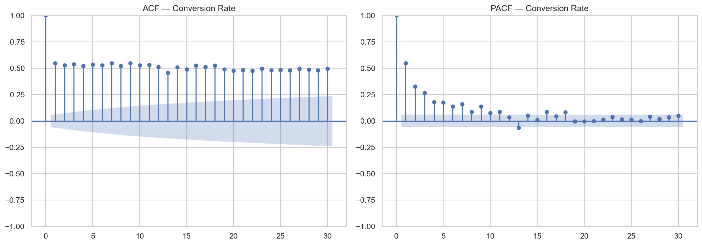
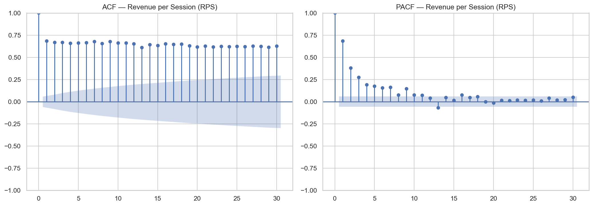
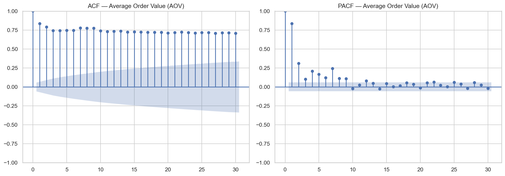
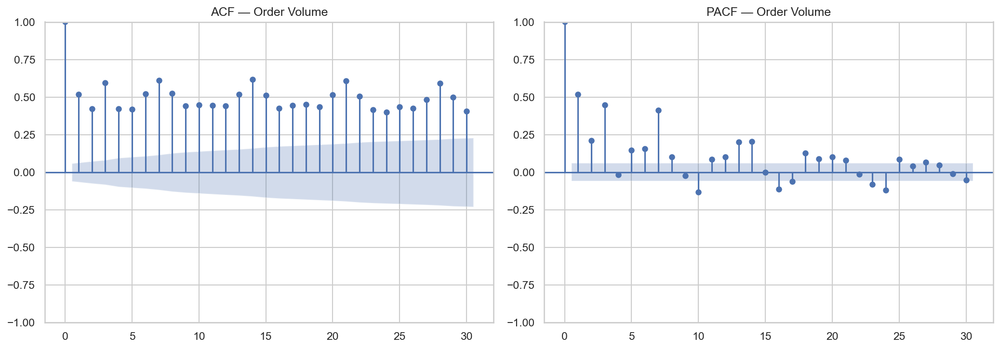
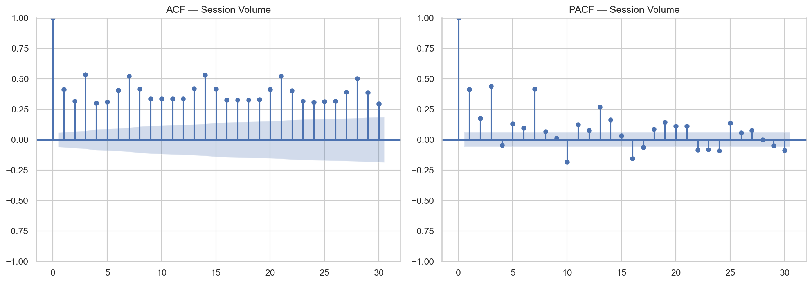
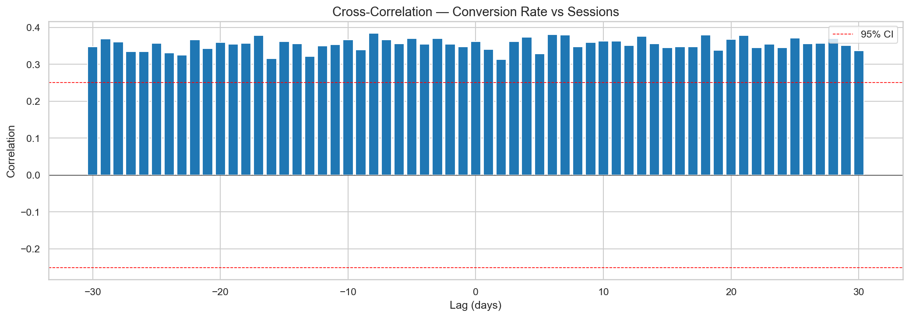

# Correlation Analysis Summary

## Methods Applied
- **Pearson Correlation** -- linear relationship with time index
- **Spearman Correlation** -- monotonic (rank-based) relationship with time index
- **ACF** -- autocorrelation up to 30 lags
- **PACF** -- partial autocorrelation up to 30 lags
- **Cross-Correlation** -- conversion rate vs session volume (+/-30 lags)

## Results Table

| Metric                    |   Pearson r |   Pearson p-value |   Spearman ρ |   Spearman p-value |
|:--------------------------|------------:|------------------:|-------------:|-------------------:|
| Conversion Rate           |    0.666778 |      7.25094e-142 |     0.664161 |       2.22449e-140 |
| Revenue per Session (RPS) |    0.801567 |      1.29889e-246 |     0.810635 |       1.5496e-256  |
| Average Order Value (AOV) |    0.79611  |      6.93892e-241 |     0.886299 |       0            |
| Order Volume              |    0.678473 |      1.06311e-148 |     0.859941 |       0            |
| Session Volume            |    0.594405 |      1.13712e-105 |     0.816571 |       2.50162e-263 |

## Interpretation

**Conversion Rate:**
- Pearson r=0.6668 (significant, p=7.25e-142)
- Spearman rho=0.6642 (significant, p=2.22e-140)

**Revenue per Session (RPS):**
- Pearson r=0.8016 (significant, p=1.30e-246)
- Spearman rho=0.8106 (significant, p=1.55e-256)

**Average Order Value (AOV):**
- Pearson r=0.7961 (significant, p=6.94e-241)
- Spearman rho=0.8863 (significant, p=0.00e+00)

**Order Volume:**
- Pearson r=0.6785 (significant, p=1.06e-148)
- Spearman rho=0.8599 (significant, p=0.00e+00)

**Session Volume:**
- Pearson r=0.5944 (significant, p=1.14e-105)
- Spearman rho=0.8166 (significant, p=2.50e-263)

## ACF/PACF Charts
| Metric | ACF & PACF Plot |
|--------|-----------------|
| Conversion Rate |  |
| Revenue per Session (RPS) |  |
| Average Order Value (AOV) |  |
| Order Volume |  |
| Session Volume |  |

## Cross-Correlation

