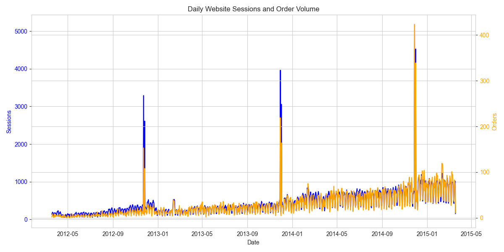
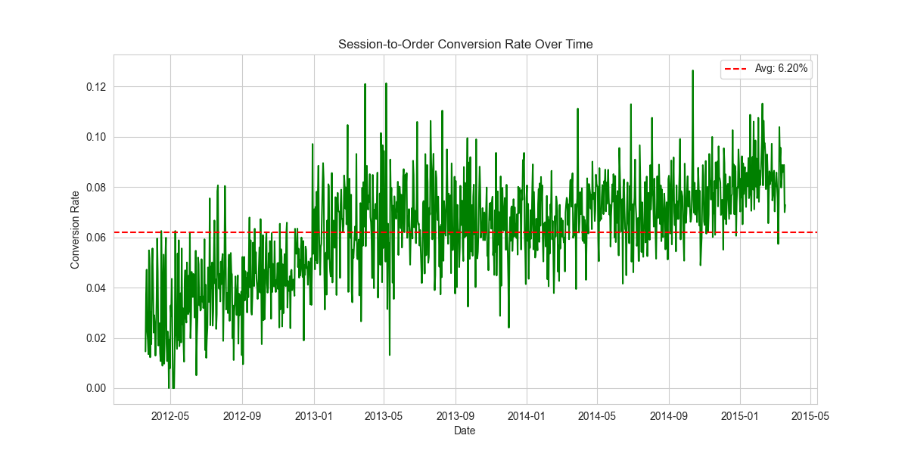
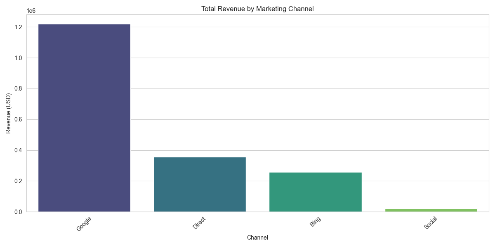
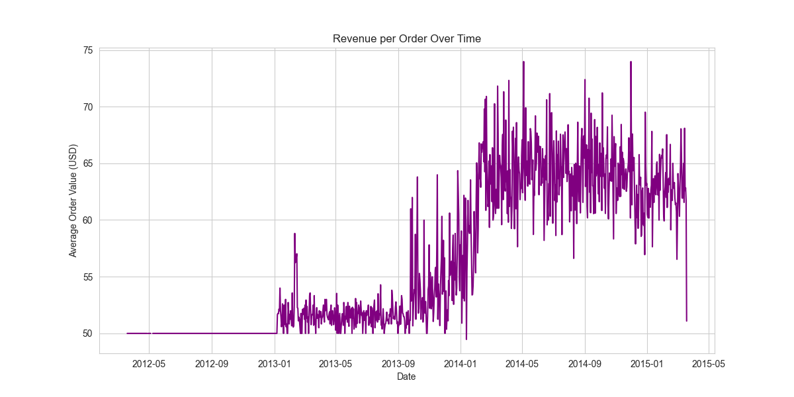
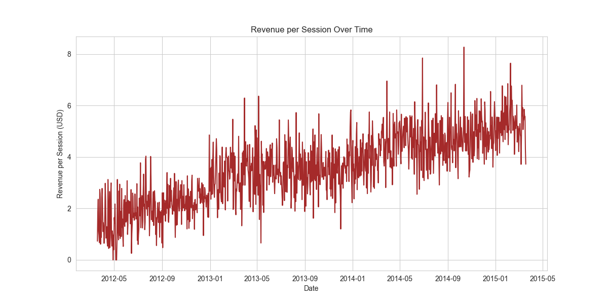

# Exploratory Data Analysis — Summary of Findings

**Dataset:** 472,871 website sessions from March 2012 to March 2015  
**Overall conversion rate:** 6.83%

---

## 1. Daily Sessions & Order Volume

Both sessions and orders show a clear **upward growth trend** over the three-year period. Traffic roughly tripled from ~100 daily sessions in early 2012 to ~800–1,000 by early 2015. Sharp seasonal spikes are visible around the **holiday season** (November–December) each year — the largest spike hit ~4,500 sessions and ~400 orders in late 2014. Orders track sessions closely, indicating that traffic growth translated into proportional revenue gains rather than being diluted by low-quality visitors.

---

## 2. Session-to-Order Conversion Rate Over Time

The daily conversion rate averages **6.20%** but improved materially over time. Early 2012 rates fluctuated between 1–6%, while by 2014–2015 the rate consistently ranged between 6–12%. This suggests ongoing **optimization of the conversion funnel** (e.g., landing-page improvements, product launches, or better-targeted traffic). Day-to-day volatility is high, but the upward trend line is unmistakable.

---

## 3. Revenue by Marketing Channel

| Channel | Sessions  | Orders | Conv. Rate | Rev/Session |
|---------|-----------|--------|------------|-------------|
| Google  | 316,035   | 21,333 | 6.75%      | $3.86       |
| Direct  | 83,328    | 6,118  | 7.34%      | $4.27       |
| Bing    | 62,823    | 4,519  | 7.19%      | $4.09       |
| Social  | 10,685    | 343    | 3.21%      | $1.99       |

**Google** dominates with ~67% of total sessions and ~$1.22M in revenue, making it the primary acquisition engine. However, **Direct** traffic has the highest conversion rate (7.34%) and the best revenue per session ($4.27), suggesting strong brand loyalty among returning visitors. **Bing** performs similarly to Direct in efficiency. **Social** lags significantly at only 3.21% conversion and ~$2 per session — it may serve more as a brand-awareness channel than a direct revenue driver.

---

## 4. Average Order Value (AOV) Over Time

AOV was flat at **~$50** from launch through late 2012 (likely a single-product era). A step change occurred around **January 2013** when AOV rose to ~$52, then a larger jump to **$60–65** around late 2013. By mid-2014, AOV peaked at **$65–74** before stabilizing around **$62–65** in early 2015. These jumps align with likely **product catalog expansions** or the introduction of higher-priced items and cross-sell opportunities.

---

## 5. Revenue per Session Over Time

Revenue per session has trended upward from **~$1.50** in early 2012 to **$5–6** by early 2015 — roughly a **3–4x improvement**. This metric captures the combined effect of conversion-rate gains and AOV increases. The steady climb confirms that the business is becoming more efficient at monetizing each visitor over time, driven by both funnel optimization and a richer product mix.

---

## Key Takeaways

- **Healthy growth trajectory:** Sessions, orders, and revenue all grew substantially over three years with no signs of plateau.
- **Conversion funnel improved:** The conversion rate nearly doubled from early 2012 levels, pointing to effective site and funnel optimization.
- **Google is the revenue engine** but Direct traffic is the most valuable per session — investing in brand-building could shift more traffic to the higher-converting Direct channel.
- **Social underperforms** on direct-response metrics and may need a revised strategy or should be valued on assisted/awareness metrics instead.
- **Product expansion drove AOV:** Step-changes in AOV suggest new product launches successfully increased basket size.
- **Revenue per session ~4x improvement** is the strongest single indicator of overall business health improvement.