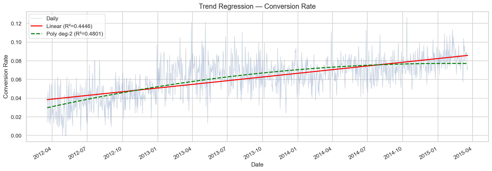
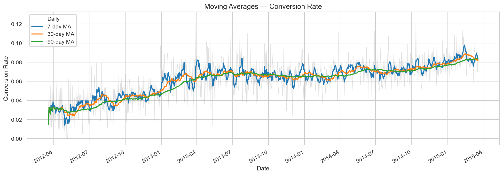
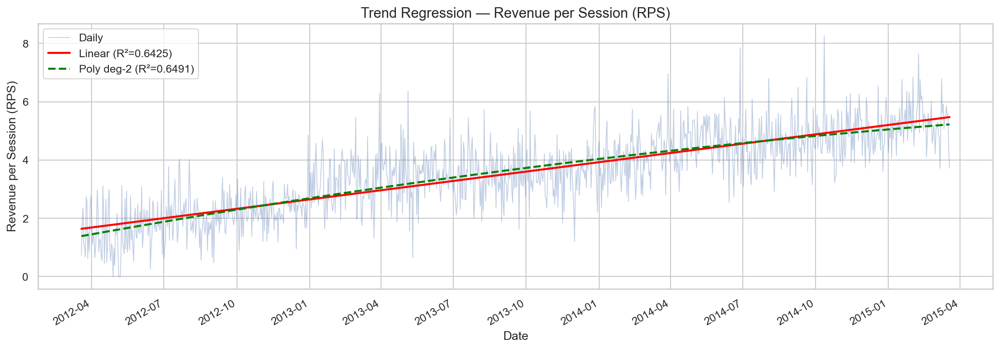
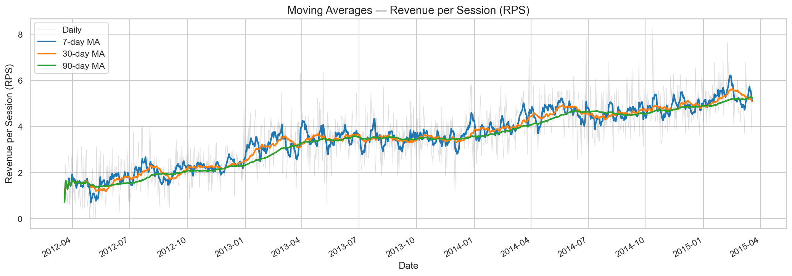
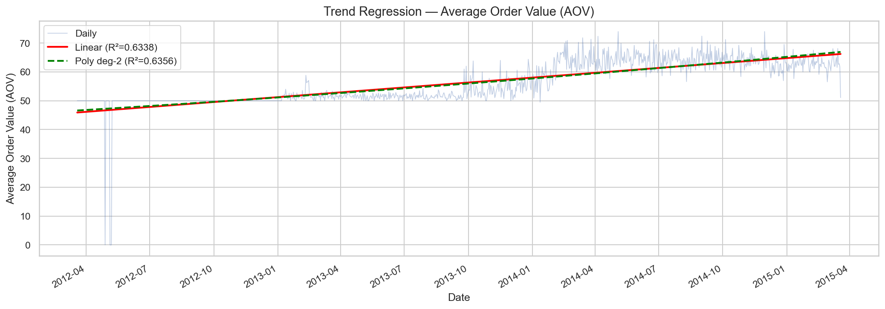
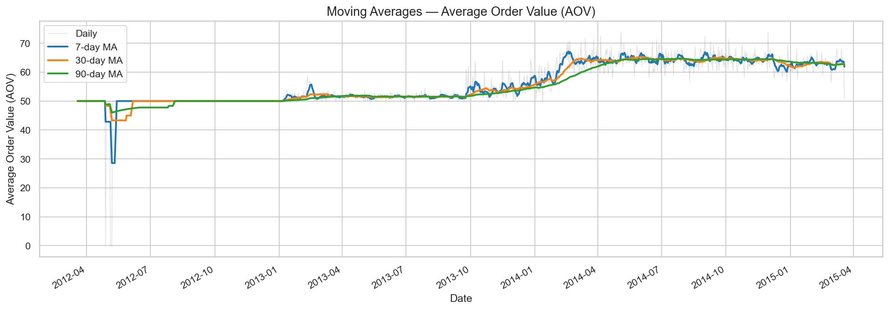
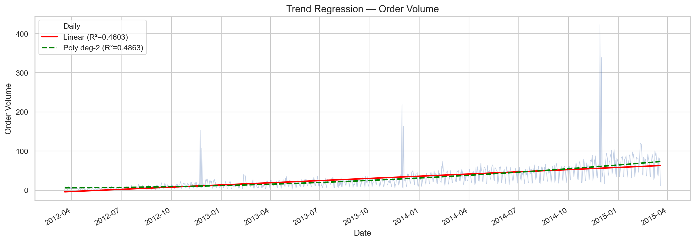
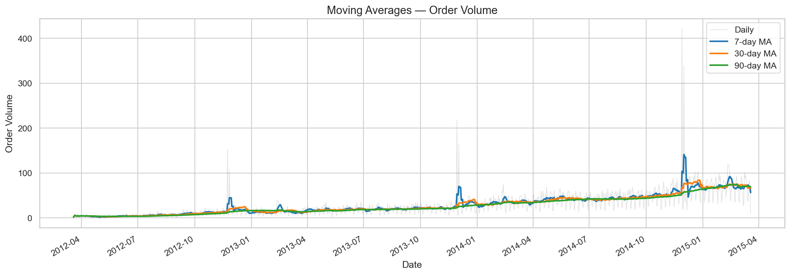
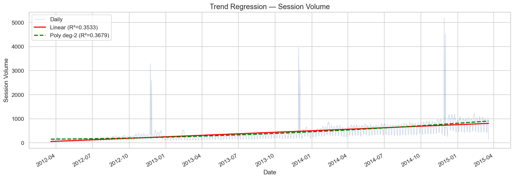
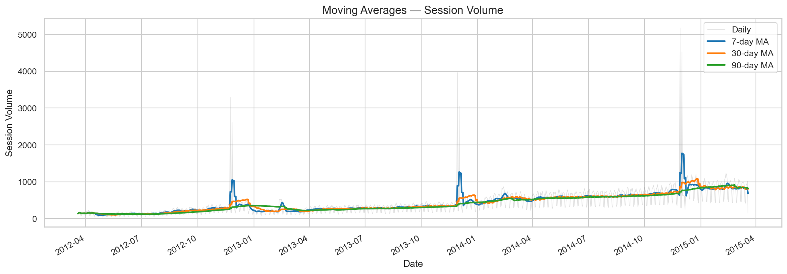

# Trend Analysis Summary

## Methods Applied
- **Linear Regression** (scipy.stats.linregress)
- **Polynomial Regression** degree 2 (numpy.polyfit)
- **Moving Averages** (7, 30, 90 day rolling windows)
- **Mann-Kendall Test** (pymannkendall)

## Results Table

| Metric                    |   Linear Slope |   Linear R² |   Linear p-value |   Poly R² | MK Trend   |   MK p-value |
|:--------------------------|---------------:|------------:|-----------------:|----------:|:-----------|-------------:|
| Conversion Rate           |    4.31723e-05 |    0.444593 |     7.25094e-142 |  0.480145 | increasing |            0 |
| Revenue per Session (RPS) |    0.00349837  |    0.64251  |     1.29889e-246 |  0.649144 | increasing |            0 |
| Average Order Value (AOV) |    0.0185351   |    0.63379  |     6.93892e-241 |  0.635624 | increasing |            0 |
| Order Volume              |    0.0612783   |    0.460325 |     1.06311e-148 |  0.486253 | increasing |            0 |
| Session Volume            |    0.688036    |    0.353317 |     1.13712e-105 |  0.367909 | increasing |            0 |

## Interpretation

**Conversion Rate:**
- Linear trend is statistically significant (p=7.25e-142), slope=0.000043/day (upward)
- Linear R2=0.4446 vs Poly R2=0.4801 -- Polynomial fits better (accelerating)
- Mann-Kendall: **increasing** (p=0.00e+00)

**Revenue per Session (RPS):**
- Linear trend is statistically significant (p=1.30e-246), slope=0.003498/day (upward)
- Linear R2=0.6425 vs Poly R2=0.6491 -- Polynomial fits better (accelerating)
- Mann-Kendall: **increasing** (p=0.00e+00)

**Average Order Value (AOV):**
- Linear trend is statistically significant (p=6.94e-241), slope=0.018535/day (upward)
- Linear R2=0.6338 vs Poly R2=0.6356 -- Polynomial fits better (accelerating)
- Mann-Kendall: **increasing** (p=0.00e+00)

**Order Volume:**
- Linear trend is statistically significant (p=1.06e-148), slope=0.061278/day (upward)
- Linear R2=0.4603 vs Poly R2=0.4863 -- Polynomial fits better (accelerating)
- Mann-Kendall: **increasing** (p=0.00e+00)

**Session Volume:**
- Linear trend is statistically significant (p=1.14e-105), slope=0.688036/day (upward)
- Linear R2=0.3533 vs Poly R2=0.3679 -- Polynomial fits better (accelerating)
- Mann-Kendall: **increasing** (p=0.00e+00)

## Charts
| Metric | Regression Plot | Moving Averages |
|--------|-----------------|-----------------|
| Conversion Rate |  |  |
| Revenue per Session (RPS) |  |  |
| Average Order Value (AOV) |  |  |
| Order Volume |  |  |
| Session Volume |  |  |
